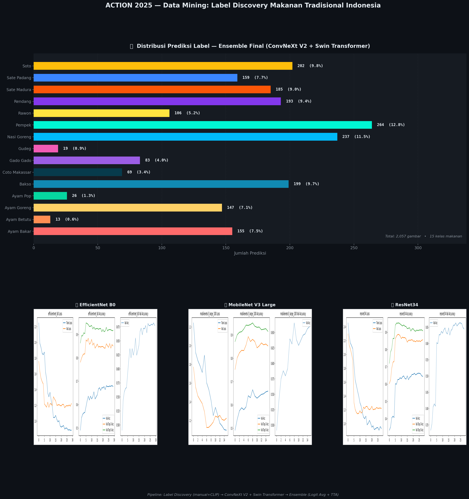
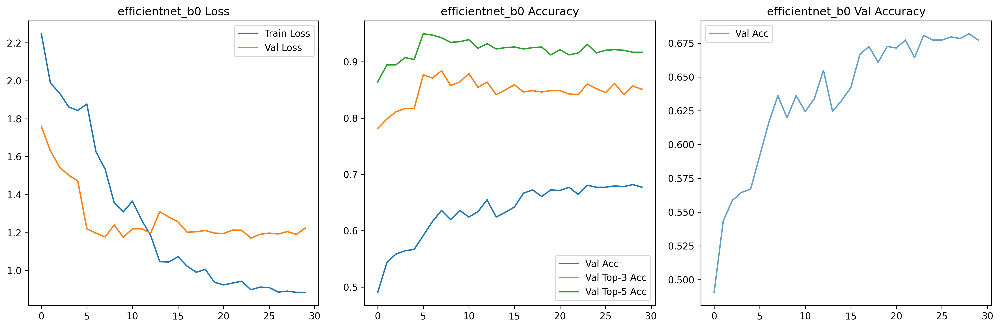
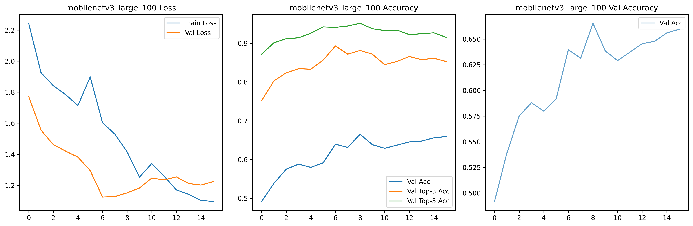
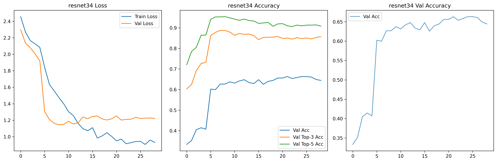

<div align="center">

# 🍛 ACTION 2025 — Data Mining: Label Discovery
### Makanan Tradisional Indonesia

[](https://python.org)
[](https://pytorch.org)
[](https://timm.fast.ai)
[](LICENSE)

*Kompetisi Data Mining — ACTION UNESA 2025*

</div>

---

## 📖 Overview

Selamat datang di **ACTION 2025 Cabang Data Mining**! Pada kompetisi ini, peserta menghadapi tantangan **Label Discovery** pada kumpulan gambar makanan tradisional Indonesia.

Pesatnya pertumbuhan volume data citra digital di berbagai domain — mulai dari media sosial hingga basis data ilmiah — telah mendorong munculnya disiplin ilmu **Data Mining Citra (Image Mining)**. Bidang ini bertujuan mengekstrak pengetahuan, pola, dan hubungan tersembunyi dari koleksi citra yang masif.

Salah satu hambatan terbesar adalah **masalah anotasi (pelabelan)**. Proses pelabelan manual sangat memakan waktu, mahal, dan tidak praktis untuk skala data besar.

Oleh karena itu, konsep **Label Discovery** menjadi esensial — proses mengidentifikasi atau menemukan label semantik yang paling relevan pada citra yang tidak berlabel, sering melibatkan teknik **unsupervised learning** seperti *clustering*.

Dalam kompetisi ini, peserta diminta untuk **menemukan dan menetapkan** (*discover and assign*) label semantik berupa **15 kategori makanan tradisional** pada citra yang tidak berlabel, kemudian melatih model classifier untuk memprediksi data uji.

---

## 📋 Deskripsi Tugas

> Anda akan menerima kumpulan gambar **tanpa label**, namun sudah mengetahui daftar 15 kemungkinan kategori makanan Nusantara.
> Tugas Anda: **temukan label yang paling sesuai** untuk setiap gambar pada data latih, lalu latih model terbaik untuk memprediksi data uji.

### 🍽️ 15 Kategori Makanan Tradisional Indonesia

| No | Label | No | Label | No | Label |
|---|---|---|---|---|---|
| 1 | 🍗 Ayam Bakar | 6 | 🥣 Coto Makassar | 11 | 🥘 Rawon |
| 2 | 🍗 Ayam Betutu | 7 | 🥗 Gado Gado | 12 | 🥩 Rendang |
| 3 | 🍗 Ayam Goreng | 8 | 🍛 Gudeg | 13 | 🍢 Sate Madura |
| 4 | 🍗 Ayam Pop | 9 | 🍳 Nasi Goreng | 14 | 🍢 Sate Padang |
| 5 | 🍜 Bakso | 10 | 🍱 Pempek | 15 | 🍲 Soto |

---

## 🗂️ Struktur Dataset

```
Action UNESA 2025/
├── train/
│   ├── train/                    # Gambar latih (tanpa label) — ~ribuan gambar
│   ├── train_cropped/            # Gambar latih yang sudah di-crop
│   ├── train_labels.csv          # Daftar ID gambar (kosong label)
│   └── train_labels_completed3.csv  # Label hasil label discovery (final)
├── test/                         # Gambar uji (tanpa label) — untuk prediksi
├── test.csv                      # Format submission yang diharapkan
├── submission_ensemble_final.csv # 🏆 Submission terbaik (final)
├── Manut Ae_Percobaan 1.py       # Script training utama
├── labelgui.py                   # GUI tool untuk pelabelan manual
└── visualize_results.py          # Script untuk menghasilkan visualisasi
```

---

## 🚀 Pipeline Solusi

```
Gambar Tanpa Label
       │
       ▼
┌─────────────────────────────────┐
│  1. LABEL DISCOVERY             │
│  • Manual labeling via GUI      │
│  • CLIP zero-shot verification  │
│  • Filtering noise images       │
└─────────────────────────────────┘
       │
       ▼
┌─────────────────────────────────┐
│  2. DATA PREPROCESSING          │
│  • Image cropping & resize 384px│
│  • RandAugment, Mixup/CutMix    │
│  • ImageNet normalization        │
└─────────────────────────────────┘
       │
       ▼
┌─────────────────────────────────┐
│  3. TRAINING (Transfer Learning)│
│  • Phase 1: Head-only training  │
│  • Phase 2: Full fine-tuning    │
│  • CosineAnnealingWarmRestarts  │
│  • EarlyStopping (patience=15)  │
└─────────────────────────────────┘
       │
       ▼
┌─────────────────────────────────┐
│  4. ENSEMBLE PREDICTION         │
│  • Logit Averaging              │
│  • Test-Time Augmentation (TTA) │
│  • Horizontal Flip TTA          │
└─────────────────────────────────┘
       │
       ▼
  submission_ensemble_final.csv
```

---

## 🤖 Model yang Digunakan

| Model | Backbone | Image Size | Params | Keterangan |
|---|---|---|---|---|
| **ConvNeXt V2 Base** | `convnextv2_base.fcmae_ft_in22k_in1k` | 384×384 | ~89M | Pretrained IN-22K |
| **Swin Transformer Base** | `swin_base_patch4_window12_384` | 384×384 | ~88M | Pretrained IN-22K |
| EfficientNet B0 | `efficientnet_b0` | 224×224 | ~5M | Baseline awal |
| MobileNet V3 Large | `mobilenetv3_large_100` | 224×224 | ~5M | Baseline ringan |
| ResNet34 | `resnet34` | 224×224 | ~21M | Baseline klasik |

> 🏆 **Final Submission**: Ensemble **ConvNeXt V2 Base** + **Swin Transformer Base** (384px, Logit Averaging + TTA)

---

## 📊 Visualisasi Hasil



### Training History — Model Baseline

| EfficientNet B0 | MobileNet V3 Large | ResNet34 |
|---|---|---|
|  |  |  |

---

## ⚙️ Cara Menjalankan

### Prasyarat
```bash
pip install torch torchvision timm pandas numpy matplotlib seaborn scikit-learn tqdm pillow
```

### 1. Label Discovery (Manual GUI)
```bash
# Buka aplikasi GUI untuk melabeli gambar satu per satu
python labelgui.py
```

### 2. Training Model
```bash
# Jalankan dari terminal (BUKAN dari notebook) karena menggunakan num_workers > 0
python "Manut Ae_Percobaan 1.py"
```

### 3. Generate Visualisasi
```bash
python visualize_results.py
```

---

## 🔧 Konfigurasi Training (Final)

```python
IMAGE_SIZE    = 384        # Resolusi tinggi untuk detail fitur
BATCH_SIZE    = 4          # Disesuaikan dengan VRAM GPU
EPOCHS        = 75         # 5 siklus Warm Restarts (5 × 15)
LR            = 1e-3       # Phase 1: head-only
FINETUNE_LR   = 2e-5       # Phase 2: full backbone
UNFREEZE_EPOCH = 5         # Epoch mulai fine-tune seluruh backbone
```

**Teknik augmentasi:**
- `RandAugment(num_ops=2, magnitude=9)`
- `RandomHorizontalFlip`, `RandomRotation(15°)`, `ColorJitter`
- `Mixup(α=0.4)` + `CutMix(α=0.4)` via `timm.data.Mixup`

**Optimizer:** `AdamW` + `weight_decay=1e-4`

**Scheduler:** `CosineAnnealingWarmRestarts(T_0=15, eta_min=1e-7)`

---

## 📁 File Penting

| File | Deskripsi |
|---|---|
| `Manut Ae_Percobaan 1.py` | Script training utama (2 model + ensemble) |
| `labelgui.py` | Aplikasi Tkinter untuk pelabelan gambar manual |
| `visualize_results.py` | Generator visualisasi distribusi & training history |
| `train/train_labels_completed3.csv` | Dataset berlabel hasil label discovery (final) |
| `submission_ensemble_final.csv` | 🏆 Submission final terbaik |
| `test.csv` | Format contoh submission |

---

## 📝 Catatan Teknis

- **Label Discovery**: Dilakukan secara **semi-manual** — inspeksi visual satu per satu menggunakan custom GUI (`labelgui.py`), dengan verifikasi menggunakan CLIP untuk kelas yang ambigu.
- **Noise filtering**: Gambar berlabel `"Kotak Putih"` (background kosong/putih) di-exclude saat training.
- **Mixed Precision**: Menggunakan `torch.amp.autocast` + `GradScaler` untuk efisiensi training di GPU.
- **Two-phase training**: Epoch 0–4 hanya melatih *classifier head*, epoch 5+ melakukan *full unfreezing* dengan LR yang jauh lebih kecil.

---

<div align="center">

**ACTION 2025 — Universitas Negeri Surabaya (UNESA)**

*Data Mining Track | Label Discovery Challenge*

</div>
